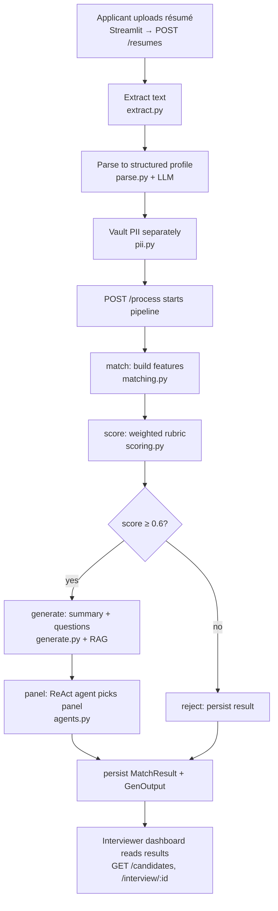

# AI-Powered Recruitment Platform

An end-to-end recruitment assistant that screens résumés, matches them to a job,
scores candidates against an explainable rubric, and uses GenAI + retrieval +
an agent to produce recruiter-ready output — a candidate summary, tailored
interview questions grounded in HR policy, a recommended interview panel, and a
policy-based pay-band suggestion.

Built with **FastAPI**, **LangChain**, **LangGraph**, **ChromaDB**, and
**Streamlit**. Every LLM/embedding call goes through a single OpenAI-compatible
client, so it runs on the official OpenAI API out of the box — or on any
compatible proxy (LiteLLM, Azure OpenAI, local vLLM/Ollama) by setting one
environment variable.

> ⚠️ **Demo / educational project.** Sample HR policies and pay bands are
> illustrative, not real. Do not use as-is for real hiring decisions.

---

## Features

- **Résumé ingestion** — extract text from PDF/DOCX, parse to a structured
  profile with an LLM (`app/extract.py`, `app/parse.py`).
- **JD matching** — LLM skill-matching (with synonyms) + semantic similarity via
  embeddings → explainable feature vector (`app/matching.py`).
- **Rubric scoring** — transparent weighted score with a per-feature breakdown
  (`app/scoring.py`).
- **RAG over HR policy** — policy docs chunked, embedded, and retrieved with
  citations (`app/rag.py`).
- **GenAI generation** — candidate summary, 5 tailored interview questions, and
  a policy-grounded pay band, all with structured (Pydantic) output
  (`app/generate.py`, `app/genschemas.py`).
- **Agentic panel recommendation** — a ReAct agent picks a compliant interview
  panel using tools over the interviewer DB and policy retrieval
  (`app/agents.py`).
- **Orchestration** — a LangGraph pipeline wires it together with a shortlist
  gate (`app/orchestrator.py`).
- **Two UIs** — an applicant app and an interviewer dashboard (Streamlit).
- **Optional ML benchmark** — a standalone XGBoost hire-prediction model
  (`train_scorer.py`, `ml_predict.py`).

---

## Architecture

```
Applicant UI ─┐                                  ┌─ Interviewer UI
              │        FastAPI  (app/main.py)     │
              └──────────────┬───────────────────┘
                             │
        LangGraph pipeline (app/orchestrator.py)
        match → score → [gate] → generate → panel
                             │
   ┌─────────────┬───────────┼───────────┬──────────────┐
 matching.py   scoring.py  generate.py  agents.py     rag.py
   │             │           │            │             │
   └──── OpenAI-compatible LLM + embeddings (app/llm.py) ┘
                             │
                    SQLite via SQLAlchemy (app/models.py)
                    Chroma vector store (HR policies)
```

---

## How it works (end-to-end workflow)

When an applicant submits a résumé, a single call to `POST /process` runs the
whole LangGraph pipeline (`app/orchestrator.py`). Here is the journey:



**Step by step**

1. **Upload & extract** — the applicant UI sends the file to `POST /resumes`.
   `extract.py` pulls raw text from the PDF/DOCX.
2. **Parse** — `parse.py` asks the LLM (structured output) to turn the raw text
   into a `CandidateProfile` (skills, experience, education, work history).
3. **Vault PII** — `pii.py` extracts personal identifiers into a separate field
   so scoring never sees them.
4. **Match** (`match_node` → `matching.py`) — LLM skill-matching with synonyms
   plus embedding-based semantic similarity produce an explainable feature set:
   `skills_coverage`, `experience_fit`, `education_match`, `semantic_similarity`,
   and the matched/missing skill lists.
5. **Score** (`score_node` → `scoring.py`) — a transparent weighted rubric turns
   those features into a 0–1 score with a per-feature breakdown.
6. **Shortlist gate** — if the score ≥ `SHORTLIST_THRESHOLD` (0.6) the candidate
   is shortlisted and the pipeline continues; otherwise it routes straight to
   `reject` and just records the result.
7. **Generate** (`generate_node` → `generate.py`) — for shortlisted candidates,
   the LLM writes a recruiter summary and 5 tailored interview questions, grounded
   in HR-policy passages retrieved via RAG (`rag.py`).
8. **Panel** (`panel_node` → `agents.py`) — a ReAct agent calls tools
   (interviewer DB + policy retrieval) to recommend a compliant 2-person panel.
9. **Persist** — `MatchResult` and `GenOutput` are written so the interviewer
   dashboard can read them (`GET /candidates`, `GET /interview/{id}`).
10. **Review** — the interviewer UI shows the ranked candidates, the summary,
    the interview kit, the recommended panel, an on-demand résumé-grounded
    question generator, and a policy-based pay-band suggestion.

> The applicant only ever sees the verdict (shortlisted + match %); the summary,
> questions, panel, and pay band are interviewer-only.

---

## Quick start

### 1. Install
```bash
python -m venv .venv && source .venv/bin/activate   # Windows: .venv\Scripts\activate
pip install -r requirements.txt
```

### 2. Configure
```bash
cp .env.example .env
# edit .env and set OPENAI_API_KEY (see .env.example for all options)
```
Defaults use standard OpenAI models (`gpt-4o`, `gpt-4o-mini`,
`text-embedding-3-large`). To use a proxy, set `OPENAI_BASE_URL`.

### 3. Run the API
```bash
uvicorn app.main:app --port 8000
```
Check health at http://localhost:8000/health and docs at
http://localhost:8000/docs

### 4. Seed data (in another terminal, with the API running)
```bash
python seed_jobs.py            # sample job openings
python app/seed_interviewers.py  # sample interviewer panel
python seed_policies.py        # ingest sample HR policies (needs the API up)
```

### 5. Launch the UIs
```bash
streamlit run app_applicant.py                       # applicant, port 8501
streamlit run app_interviewer.py --server.port 8502  # interviewer dashboard
```

---

## Project structure

```
app/
  main.py          FastAPI app + all endpoints
  config.py        env-based config (keys, base URL, models)
  llm.py           OpenAI-compatible chat + embedding clients
  db.py            SQLAlchemy engine/session
  models.py        ORM tables
  schemas.py       CandidateProfile (résumé parse schema)
  genschemas.py    GenAI structured-output schemas
  extract.py       PDF/DOCX text extraction
  parse.py         résumé -> structured profile (LLM)
  pii.py           PII extraction (vaulted separately)
  matching.py      skill match + semantic similarity -> features
  scoring.py       weighted rubric score
  rag.py           HR-policy ingestion + retrieval (Chroma)
  generate.py      summary / questions / pay band (LLM)
  agents.py        ReAct interview-panel agent
  orchestrator.py  LangGraph pipeline
  seed_interviewers.py

app_applicant.py     Streamlit applicant UI
app_interviewer.py   Streamlit interviewer dashboard
seed_jobs.py         seed sample jobs
seed_policies.py     seed sample HR policies (via API)
clearData.py         wipe candidates/matches/outputs (keeps jobs/policies)
debug_flow.py        end-to-end pipeline tracer
train_scorer.py      train the optional XGBoost model
ml_predict.py        run the trained model on sample candidates
```

---

## Optional: ML hire-prediction benchmark

`train_scorer.py` trains a standalone XGBoost classifier as a benchmark; it is
**not** wired into the scoring pipeline (the rubric in `scoring.py` makes the
shortlist decision). It expects a CSV named `resume_dataset_200k_enhanced.csv`
with a binary `hired` label and feature columns (e.g. `education_level`,
`university_tier`, `company_type`, …). That dataset is not included in the repo
(size); supply your own with those columns, then:

```bash
python train_scorer.py   # trains, prints metrics, saves hire_model.pkl
python ml_predict.py      # scores sample rows with the saved model
```

---

## Notes

- **No secrets in the repo** — configuration is via `.env` (gitignored). Copy
  `.env.example` to get started.
- **Debugging** — `.vscode/launch.json` provides ready-to-use debug configs
  (FastAPI, both Streamlit apps, the ML scripts) and a compound "run all".
- **Tech stack** — FastAPI · SQLAlchemy · LangChain · LangGraph · ChromaDB ·
  Pydantic · Streamlit · XGBoost.
